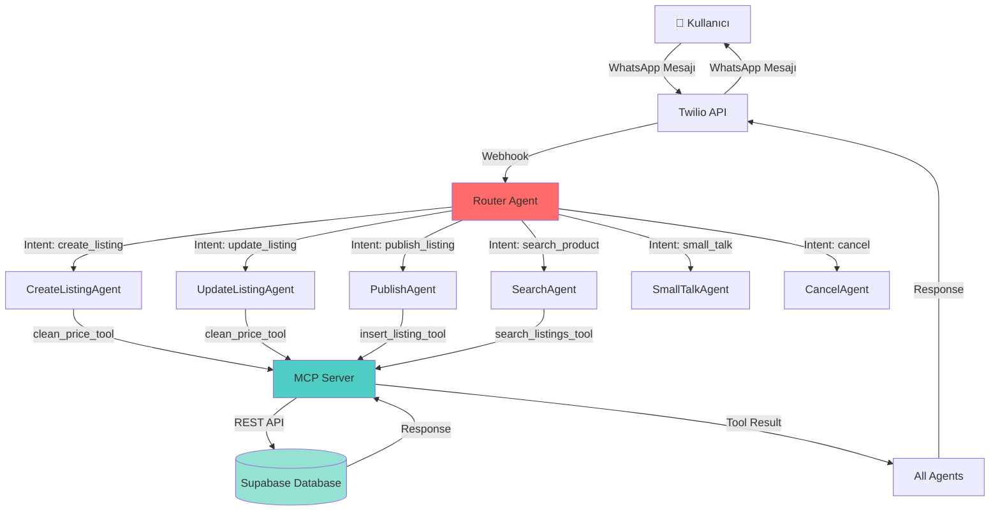
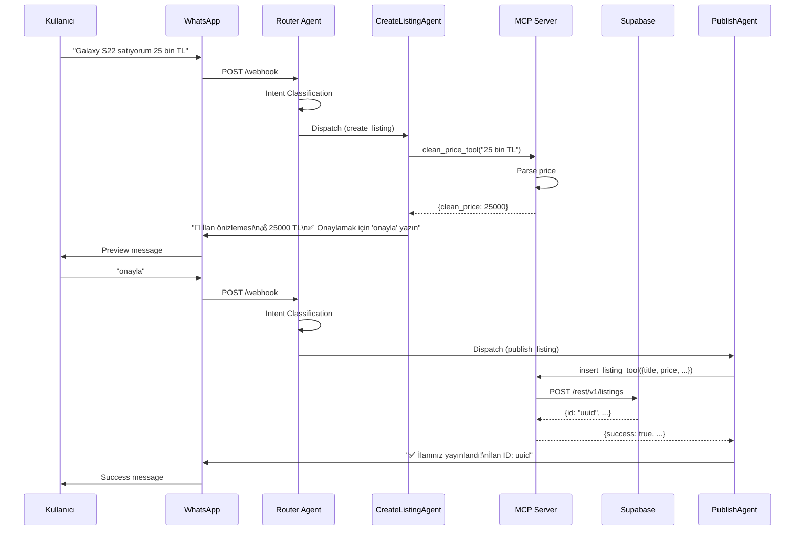
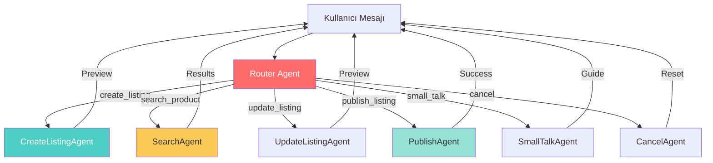
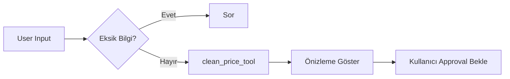
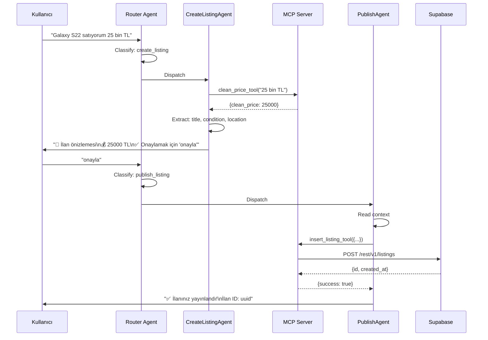
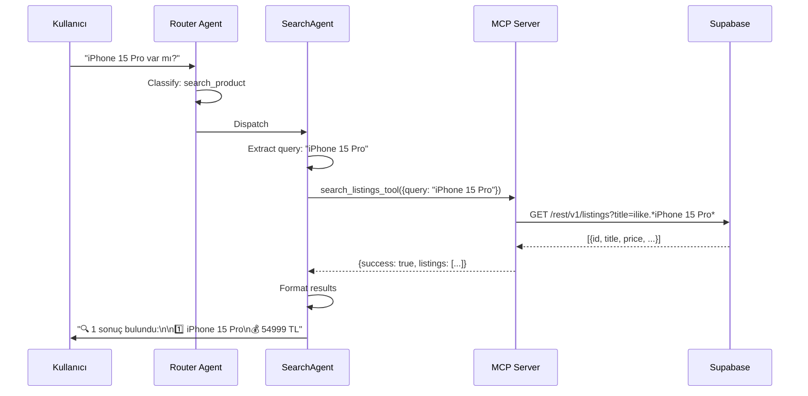
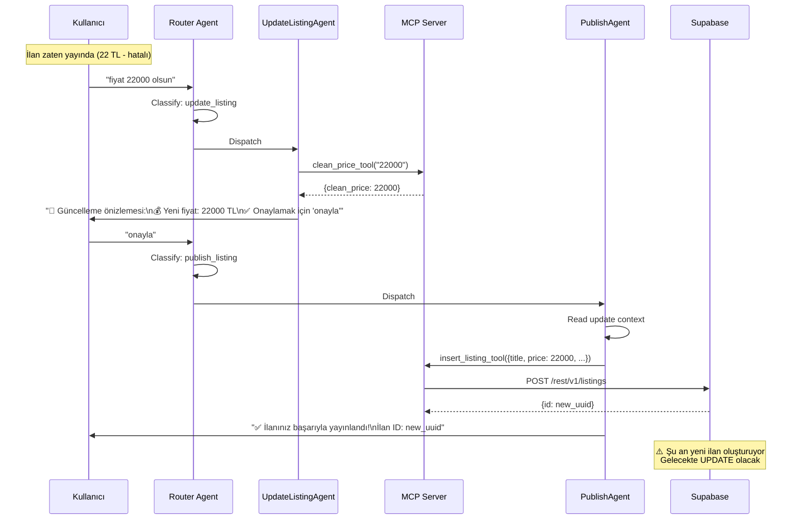
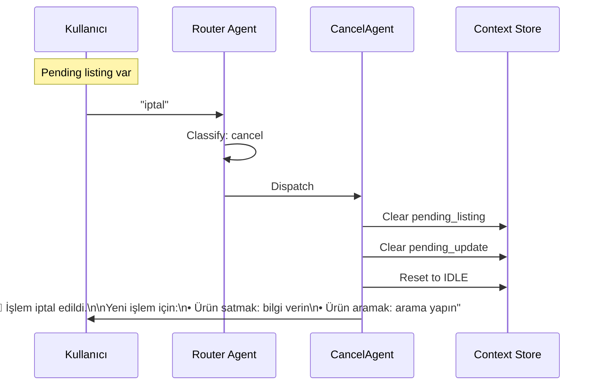
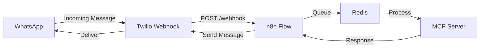
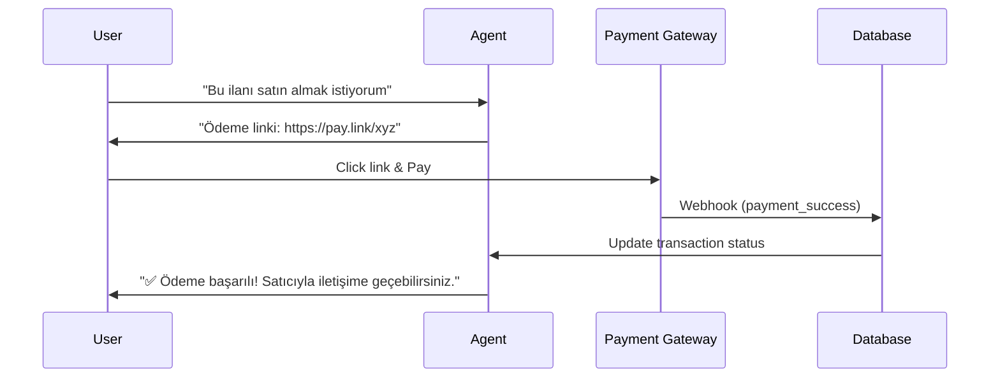

# 🛍️ PazarGlobal - AI-Powered Marketplace Platform

> WhatsApp tabanlı, yapay zeka destekli yeni nesil pazar yeri platformu

[](https://python.org)
[](https://github.com/modelcontextprotocol)
[](https://railway.app)
[](https://supabase.com)
[](https://platform.openai.com)

---

## 📋 İçindekiler

- [Proje Özeti](#-proje-özeti)
- [Mimari Genel Bakış](#-mimari-genel-bakış)
- [Kurulum](#-kurulum)
- [Agent Architecture](#-agent-architecture)
- [MCP Tools](#-mcp-tools)
- [Workflow Diyagramları](#-workflow-diyagramları)
- [API Endpoints](#-api-endpoints)
- [Veritabanı Şeması](#-veritabanı-şeması)
- [Gelecek Özellikler (Roadmap)](#-gelecek-özellikler-roadmap)
- [Deployment](#-deployment)
- [Test Senaryoları](#-test-senaryoları)
- [Katkıda Bulunma](#-katkıda-bulunma)

---

## 🎯 Proje Özeti

**PazarGlobal**, kullanıcıların WhatsApp üzerinden yapay zeka ajanları ile etkileşimde bulunarak ürün alıp satabildikleri, modern bir online pazar yeri platformudur.

### Temel Özellikler

- 🤖 **7 Özelleşmiş AI Agent** - Her görev için optimize edilmiş ajanlar
- 💬 **WhatsApp Entegrasyonu** - Twilio üzerinden native WhatsApp deneyimi
- 🔒 **Güvenli Ödeme** - Stripe/İyzico entegrasyonu (planning)
- 📸 **Vision AI** - Fotoğraftan ürün tanıma ve fiyat tahmini (planning)
- 🎙️ **Sesli Mesajlaşma** - Ses tanıma ve sesli yanıtlar (planning)
- 🌐 **Web Dashboard** - Modern React/Next.js arayüzü (planning)
- 🔍 **Market Intelligence** - Web scraping ile piyasa fiyat araştırması (planning)

### Teknoloji Stack

**Backend:**
- Python 3.11
- FastMCP (Model Context Protocol)
- FastAPI / Starlette
- Uvicorn ASGI Server
- httpx (async HTTP client)

**Database:**
- Supabase (PostgreSQL)
- REST API Integration

**AI/ML:**
- OpenAI GPT-5.1 (Agent Builder)
- OpenAI Vision API (planning)
- Azure Computer Vision (planning)

**Infrastructure:**
- Railway (Cloud Deployment)
- GitHub Actions (CI/CD)
- Docker (Containerization)

**Communication:**
- Twilio WhatsApp Business API
- Server-Sent Events (SSE)

---

## 🏗️ Mimari Genel Bakış



### Veri Akışı



---

## 🚀 Kurulum

### Gereksinimler

- Python 3.11+
- Git
- Railway CLI (optional)
- Supabase Account
- OpenAI API Key
- Twilio Account (WhatsApp Business)

### 1. Repository Clone

```bash
git clone https://github.com/emrahbadas00-lgtm/Pazarglobal.git
cd Pazarglobal/pazarglobal_mcp
```

### 2. Virtual Environment

```bash
# Windows
python -m venv venv
venv\Scripts\activate

# macOS/Linux
python3 -m venv venv
source venv/bin/activate
```

### 3. Dependencies

```bash
pip install -r requirements.txt
```

**requirements.txt:**
```txt
mcp
fastapi
uvicorn
httpx
python-dotenv
starlette
```

### 4. Environment Variables

`.env` dosyası oluşturun:

```env
# OpenAI
OPENAI_API_KEY=sk-proj-...

# Supabase
SUPABASE_URL=https://xxxxx.supabase.co
SUPABASE_SERVICE_KEY=eyJhbGciOiJIUzI1NiIsInR5cCI6IkpXVCJ9...

# Twilio (WhatsApp)
TWILIO_ACCOUNT_SID=ACxxxx
TWILIO_AUTH_TOKEN=xxxx

# Server
HOST=0.0.0.0
PORT=8000
DEBUG=true

# Tavily Search (Optional)
TAVILY_API_KEY=tvly-xxxx

# n8n Webhook (Optional)
N8N_WEBHOOK_URL=https://xxx.app.n8n.cloud/webhook/whatsapp-bridge
```

### 5. Supabase Setup

Supabase Dashboard'da `listings` tablosu oluşturun:

```sql
CREATE TABLE listings (
  id UUID PRIMARY KEY DEFAULT gen_random_uuid(),
  user_id UUID,
  title TEXT NOT NULL,
  description TEXT,
  category TEXT,
  price NUMERIC,
  stock INT DEFAULT 1,
  location TEXT,
  status TEXT DEFAULT 'active',
  condition TEXT,
  image_url TEXT,
  metadata JSONB,
  created_at TIMESTAMP DEFAULT now(),
  updated_at TIMESTAMP DEFAULT now(),
  view_count INT DEFAULT 0,
  market_price_at_publish NUMERIC,
  last_price_check_at TIMESTAMP
);

-- Indexes
CREATE INDEX idx_listings_status ON listings(status);
CREATE INDEX idx_listings_category ON listings(category);
CREATE INDEX idx_listings_price ON listings(price);
CREATE INDEX idx_listings_location ON listings(location);
```

### 6. Local Test

```bash
python server.py
```

Server çalışıyorsa:
```
🚀 Pazarglobal MCP Server başlatılıyor...
📡 Host: 0.0.0.0:8000
🔧 Tools: clean_price_tool, insert_listing_tool, search_listings_tool
🌐 SSE Endpoint: http://0.0.0.0:8000/sse
INFO:     Uvicorn running on http://0.0.0.0:8000
```

---

## 🤖 Agent Architecture

PazarGlobal, **7 özelleşmiş AI Agent** kullanır. Her agent tek bir sorumluluğa sahiptir.

### Agent Hiyerarşisi



### 1. Router Agent (Intent Classifier)

**Görev:** Kullanıcı mesajını analiz edip doğru intent'i belirler.

**Model:** GPT-5.1  
**Tools:** Yok  
**Output:** JSON schema

**Intent Types:**
- `create_listing` - Ürün satma niyeti
- `search_product` - Ürün arama/alma niyeti
- `update_listing` - İlan güncelleme niyeti
- `publish_listing` - İlan onaylama
- `small_talk` - Genel sohbet
- `cancel` - İptal/reset

**Instructions:**
```
You classify user messages into marketplace intents.

Examples:
• "iPhone 13 satıyorum 20 bin TL" → create_listing
• "MacBook almak istiyorum" → search_product
• "fiyat 22 bin olsun" → update_listing
• "onayla" → publish_listing
• "merhaba" → small_talk
• "iptal" → cancel
```

---

### 2. CreateListingAgent

**Görev:** Yeni ilan bilgilerini toplar, önizleme gösterir (DB'ye yazmaz).

**Model:** GPT-5.1  
**Tools:** `clean_price_tool`  
**State:** Pending listing context'e kaydedilir

**Flow:**


**Instructions:**
```
You are CreateListingAgent of PazarGlobal.

🎯 Your task: PREPARE listing, DO NOT insert to database yet.

📋 Extract fields:
- title → product title
- price → call clean_price_tool if text
- condition → "new", "used", "refurbished"
- category → infer from product
- description → friendly Turkish
- location → default "Türkiye"
- stock → default 1

📝 When ALL required fields ready:
Show PREVIEW:
"📝 İlan önizlemesi:
📱 [title]
💰 [price] TL
📦 Durum: [condition]
📍 [location]

✅ Onaylamak için 'onayla' yazın"

🚫 NEVER call insert_listing_tool - that's PublishAgent's job!
```

**Example:**
```
User: "Galaxy S22 128GB mavi, 1 sene kullanıldı, 25 bin TL"
Agent: [Calls clean_price_tool("25 bin TL")]
Agent: "📝 İlan önizlemesi:
       📱 Samsung Galaxy S22 128GB Mavi
       💰 25000 TL
       📦 Durum: used
       📍 Türkiye
       
       ✅ Onaylamak için 'onayla' yazın"
```

---

### 3. SearchAgent

**Görev:** Supabase'den ilan arar, sonuçları formatlar.

**Model:** GPT-5.1  
**Tools:** `search_listings_tool`  
**State:** Read-only

**Instructions:**
```
You are SearchAgent of PazarGlobal.

🎯 Your ONLY task: Search products.

🔍 Extract from user message:
- query → product keywords
- category → infer
- condition → "new"/"used"
- location → city
- min_price / max_price → price range
- limit → default 10

✅ Results Format:
"🔍 [X] sonuç bulundu:

1️⃣ [title]
   💰 [price] TL | 📍 [location] | [condition]"

❌ No Results:
"Aramanızla eşleşen ilan bulunamadı."
```

**Example:**
```
User: "iPhone 15 Pro var mı?"
Agent: [Calls search_listings_tool(query="iPhone 15 Pro")]
Agent: "🔍 1 sonuç bulundu:
       
       1️⃣ iPhone 15 Pro 128GB
          💰 54999 TL | 📍 İstanbul | new"
```

---

### 4. UpdateListingAgent

**Görev:** Mevcut ilan bilgilerini güncellemeye hazırlar (DB'ye yazmaz).

**Model:** GPT-5.1  
**Tools:** `clean_price_tool`  
**State:** Pending update context'e kaydedilir

**Instructions:**
```
You are UpdateListingAgent of PazarGlobal.

🎯 Your task: PREPARE listing updates, DO NOT save yet.

📝 What can be updated:
- price → "fiyat X olsun"
- description → "açıklamayı değiştir"
- condition → "ikinci el yap"

📋 Show UPDATE preview:
"📝 Güncelleme önizlemesi:
💰 Yeni fiyat: [price] TL

✅ Onaylamak için 'onayla' yazın"

🚫 DO NOT call insert_listing_tool
```

**Example:**
```
User: "fiyat 22 bin olsun"
Agent: [Calls clean_price_tool("22 bin")]
Agent: "📝 Güncelleme önizlemesi:
       💰 Yeni fiyat: 22000 TL
       
       ✅ Onaylamak için 'onayla' yazın"
```

---

### 5. PublishAgent

**Görev:** Onay alınca pending listing'i Supabase'e yazar.

**Model:** GPT-5.1  
**Tools:** `insert_listing_tool`  
**State:** Context'ten listing data okur

**Critical Rule:** `insert_listing_tool` **sadece bu agent kullanır!**

**Instructions:**
```
You are PublishAgent of PazarGlobal.

🎯 Your ONLY task: Insert prepared listing to database.

✅ Trigger Words:
"onayla", "yayınla", "tamam", "evet"

📋 Flow:
1. Check conversation context for prepared listing
2. If found → call insert_listing_tool with ALL fields
3. If not found → ask user to create listing first

✅ Success Response:
"✅ İlanınız başarıyla yayınlandı!
📱 [title]
💰 [price] TL
İlan ID: [supabase_id]"
```

**Example:**
```
User: "onayla"
Agent: [Reads pending listing from context]
Agent: [Calls insert_listing_tool({title, price, ...})]
Agent: "✅ İlanınız başarıyla yayınlandı!
       📱 Samsung Galaxy S22 128GB
       💰 22000 TL
       İlan ID: 8d36c84d-..."
```

---

### 6. SmallTalkAgent

**Görev:** Genel sohbet, yönlendirme, yardım.

**Model:** GPT-5.1  
**Tools:** Yok  
**State:** Stateless

**Instructions:**
```
You are SmallTalkAgent of PazarGlobal.

💬 Examples:

"Merhaba" → "Merhaba! 👋 PazarGlobal'e hoş geldiniz!
             🛒 Ürün satmak için: Ürün bilgilerini yazın
             🔍 Ürün aramak için: Ne aradığınızı söyleyin"

"Teşekkürler" → "Rica ederim! 😊 Başka yardım?"

🎯 Always end with guidance to:
- create_listing (satış)
- search_product (arama)
```

---

### 7. CancelAgent

**Görev:** İşlem iptal, context temizleme.

**Model:** GPT-5.1  
**Tools:** Yok  
**State:** Context reset

**Instructions:**
```
You are CancelAgent of PazarGlobal.

🔄 Trigger:
"iptal", "vazgeç", "sıfırla", "başa dön"

✅ Response:
"🔄 İşlem iptal edildi.

Yeni bir işlem için:
• Ürün satmak: Ürün bilgilerini yazın
• Ürün aramak: Ne aradığınızı söyleyin"

📋 Actions:
- Clear pending_listing
- Clear pending_update
- Reset to IDLE state
```

---

## 🛠️ MCP Tools

MCP Server 3 tool sağlar:

### 1. clean_price_tool

**Görev:** Türkçe fiyat formatlarını parse eder.

**Input:**
```json
{
  "price_text": "22 bin TL"
}
```

**Output:**
```json
{
  "clean_price": 22000
}
```

**Desteklenen Formatlar:**
- `"22 bin"` → 22000
- `"1,5 milyon"` → 1500000
- `"54,999 TL"` → 54999
- `"45.000"` → 45000

**Kod:**
```python
def clean_price(price_text: Optional[str]) -> Dict[str, Optional[int]]:
    if not price_text:
        return {"clean_price": None}
    
    text = price_text.lower().strip()
    
    # "bin" ve "milyon" desteği
    multiplier = 1
    if "milyon" in text:
        multiplier = 1_000_000
        text = text.replace("milyon", "")
    elif "bin" in text:
        multiplier = 1_000
        text = text.replace("bin", "")
    
    # Temizle
    cleaned = re.sub(r"[^\d,.]", "", text)
    cleaned = cleaned.replace(",", "").replace(".", "")
    
    if not cleaned:
        return {"clean_price": None}
    
    number = int(cleaned) * multiplier
    return {"clean_price": number}
```

---

### 2. insert_listing_tool

**Görev:** Supabase'e yeni ilan ekler.

**Input:**
```json
{
  "title": "Samsung Galaxy S22 128GB",
  "price": 22000,
  "condition": "used",
  "category": "Elektronik",
  "description": "Temiz, 1 sene kullanıldı",
  "location": "İstanbul",
  "stock": 1
}
```

**Output:**
```json
{
  "success": true,
  "status": 201,
  "result": {
    "id": "8d36c84d-d6e9-4d79-ab5a-60dff36d677d",
    "title": "Samsung Galaxy S22 128GB",
    "price": 22000,
    "created_at": "2025-11-28T15:10:00Z"
  }
}
```

**Kod:**
```python
async def insert_listing(
    title: str,
    price: Optional[int] = None,
    condition: Optional[str] = None,
    category: Optional[str] = None,
    description: Optional[str] = None,
    location: Optional[str] = None,
    stock: Optional[int] = None,
) -> Dict[str, Any]:
    url = f"{SUPABASE_URL}/rest/v1/listings"
    
    payload = {
        "title": title,
        "price": price,
        "condition": condition,
        "category": category,
        "description": description,
        "location": location,
        "stock": stock,
        "status": "active",
    }
    
    headers = {
        "Content-Type": "application/json",
        "apikey": SUPABASE_SERVICE_KEY,
        "Authorization": f"Bearer {SUPABASE_SERVICE_KEY}",
        "Prefer": "return=representation",
    }
    
    async with httpx.AsyncClient(timeout=30.0) as client:
        resp = await client.post(url, json=payload, headers=headers)
    
    return {
        "success": resp.is_success,
        "status": resp.status_code,
        "result": resp.json(),
    }
```

---

### 3. search_listings_tool

**Görev:** Supabase'den ilan arar.

**Input:**
```json
{
  "query": "iPhone",
  "category": "Elektronik",
  "condition": "new",
  "location": "İstanbul",
  "min_price": null,
  "max_price": 50000,
  "limit": 10
}
```

**Output:**
```json
{
  "success": true,
  "count": 1,
  "listings": [
    {
      "id": "uuid",
      "title": "iPhone 15 Pro 128GB",
      "price": 54999,
      "location": "İstanbul",
      "condition": "new"
    }
  ]
}
```

**Kod:**
```python
async def search_listings(
    query: Optional[str] = None,
    category: Optional[str] = None,
    condition: Optional[str] = None,
    location: Optional[str] = None,
    min_price: Optional[int] = None,
    max_price: Optional[int] = None,
    limit: int = 10,
) -> Dict[str, Any]:
    url = f"{SUPABASE_URL}/rest/v1/listings"
    
    params = {"status": "eq.active", "limit": limit}
    
    if query:
        params["title"] = f"ilike.*{query}*"
    if category:
        params["category"] = f"eq.{category}"
    if condition:
        params["condition"] = f"eq.{condition}"
    if location:
        params["location"] = f"ilike.*{location}*"
    if min_price:
        params["price"] = f"gte.{min_price}"
    if max_price:
        params["price"] = f"lte.{max_price}"
    
    headers = {
        "apikey": SUPABASE_SERVICE_KEY,
        "Authorization": f"Bearer {SUPABASE_SERVICE_KEY}",
    }
    
    async with httpx.AsyncClient(timeout=20.0) as client:
        resp = await client.get(url, params=params, headers=headers)
    
    data = resp.json()
    return {
        "success": resp.is_success,
        "count": len(data),
        "listings": data,
    }
```

---

## 📊 Workflow Diyagramları

### Create Listing Flow



---

### Search Product Flow



---

### Update & Republish Flow



---

### Cancel Flow



---

## 🌐 API Endpoints

### MCP Server Endpoints

**Base URL:** `https://pazarglobal-production.up.railway.app`

#### 1. SSE Endpoint (MCP)

```
GET /sse
```

**Description:** Model Context Protocol Server-Sent Events endpoint. OpenAI Agent Builder buraya bağlanır.

**Headers:**
- `Accept: text/event-stream`

**Response:**
```
data: {"tools": [...], "version": "1.0"}
```

---

#### 2. POST /sse (Redirect)

```
POST /sse
```

**Description:** Agent Builder POST istekleri için 307 redirect. (Starlette workaround)

**Response:**
```
HTTP/1.1 307 Temporary Redirect
Location: /sse
```

---

### Supabase REST API

**Base URL:** `https://snovwbffwvmkgjulrtsm.supabase.co/rest/v1`

#### 1. Get Listings

```
GET /listings?status=eq.active&limit=10
```

**Headers:**
```
apikey: <SUPABASE_SERVICE_KEY>
Authorization: Bearer <SUPABASE_SERVICE_KEY>
```

**Response:**
```json
[
  {
    "id": "uuid",
    "title": "iPhone 15 Pro",
    "price": 54999,
    "condition": "new",
    "location": "İstanbul",
    "created_at": "2025-11-28T10:00:00Z"
  }
]
```

---

#### 2. Create Listing

```
POST /listings
```

**Headers:**
```
Content-Type: application/json
apikey: <SUPABASE_SERVICE_KEY>
Authorization: Bearer <SUPABASE_SERVICE_KEY>
Prefer: return=representation
```

**Body:**
```json
{
  "title": "Samsung Galaxy S22",
  "price": 22000,
  "condition": "used",
  "category": "Elektronik",
  "description": "Temiz",
  "location": "İstanbul",
  "stock": 1,
  "status": "active"
}
```

**Response:**
```json
{
  "id": "8d36c84d-...",
  "title": "Samsung Galaxy S22",
  "created_at": "2025-11-28T15:10:00Z"
}
```

---

## 💾 Veritabanı Şeması

### Mevcut Schema (v1.0)

```sql
CREATE TABLE listings (
  id UUID PRIMARY KEY DEFAULT gen_random_uuid(),
  user_id UUID,
  title TEXT NOT NULL,
  description TEXT,
  category TEXT,
  price NUMERIC,
  stock INT DEFAULT 1,
  location TEXT,
  status TEXT DEFAULT 'active',
  condition TEXT,
  image_url TEXT,
  metadata JSONB,
  created_at TIMESTAMP DEFAULT now(),
  updated_at TIMESTAMP DEFAULT now(),
  view_count INT DEFAULT 0,
  market_price_at_publish NUMERIC,
  last_price_check_at TIMESTAMP
);

CREATE INDEX idx_listings_status ON listings(status);
CREATE INDEX idx_listings_category ON listings(category);
CREATE INDEX idx_listings_price ON listings(price);
CREATE INDEX idx_listings_location ON listings(location);
CREATE INDEX idx_listings_user_id ON listings(user_id);
```

---

### Gelecek Schema (v2.0 - Planning)

```sql
-- Users table
CREATE TABLE users (
  id UUID PRIMARY KEY DEFAULT gen_random_uuid(),
  phone_number TEXT UNIQUE NOT NULL,
  name TEXT,
  email TEXT,
  avatar_url TEXT,
  kyc_verified BOOLEAN DEFAULT false,
  kyc_documents JSONB,
  trust_score NUMERIC DEFAULT 0,
  total_sales INT DEFAULT 0,
  total_purchases INT DEFAULT 0,
  blocked BOOLEAN DEFAULT false,
  created_at TIMESTAMP DEFAULT now(),
  updated_at TIMESTAMP DEFAULT now()
);

-- User sessions
CREATE TABLE user_sessions (
  id UUID PRIMARY KEY DEFAULT gen_random_uuid(),
  user_id UUID REFERENCES users(id),
  started_at TIMESTAMP DEFAULT now(),
  last_message_at TIMESTAMP DEFAULT now(),
  context JSONB,
  platform TEXT DEFAULT 'whatsapp'
);

-- Conversations
CREATE TABLE conversations (
  id UUID PRIMARY KEY DEFAULT gen_random_uuid(),
  user_id UUID REFERENCES users(id),
  listing_id UUID REFERENCES listings(id),
  other_user_id UUID REFERENCES users(id),
  started_at TIMESTAMP DEFAULT now(),
  last_message_at TIMESTAMP DEFAULT now(),
  status TEXT DEFAULT 'active'
);

-- Messages
CREATE TABLE messages (
  id UUID PRIMARY KEY DEFAULT gen_random_uuid(),
  conversation_id UUID REFERENCES conversations(id),
  sender_id UUID REFERENCES users(id),
  content TEXT,
  message_type TEXT DEFAULT 'text',
  media_url TEXT,
  read BOOLEAN DEFAULT false,
  created_at TIMESTAMP DEFAULT now()
);

-- Transactions
CREATE TABLE transactions (
  id UUID PRIMARY KEY DEFAULT gen_random_uuid(),
  listing_id UUID REFERENCES listings(id),
  buyer_id UUID REFERENCES users(id),
  seller_id UUID REFERENCES users(id),
  amount NUMERIC NOT NULL,
  status TEXT DEFAULT 'pending',
  payment_method TEXT,
  payment_id TEXT,
  escrow BOOLEAN DEFAULT false,
  completed_at TIMESTAMP,
  created_at TIMESTAMP DEFAULT now()
);

-- Reviews
CREATE TABLE reviews (
  id UUID PRIMARY KEY DEFAULT gen_random_uuid(),
  transaction_id UUID REFERENCES transactions(id),
  reviewer_id UUID REFERENCES users(id),
  reviewee_id UUID REFERENCES users(id),
  rating INT CHECK (rating >= 1 AND rating <= 5),
  comment TEXT,
  created_at TIMESTAMP DEFAULT now()
);

-- Favorites
CREATE TABLE favorites (
  id UUID PRIMARY KEY DEFAULT gen_random_uuid(),
  user_id UUID REFERENCES users(id),
  listing_id UUID REFERENCES listings(id),
  created_at TIMESTAMP DEFAULT now(),
  UNIQUE(user_id, listing_id)
);

-- Saved searches
CREATE TABLE saved_searches (
  id UUID PRIMARY KEY DEFAULT gen_random_uuid(),
  user_id UUID REFERENCES users(id),
  query TEXT,
  filters JSONB,
  alert_enabled BOOLEAN DEFAULT false,
  created_at TIMESTAMP DEFAULT now()
);
```

---

## 🚧 Gelecek Özellikler (Roadmap)

### Phase 1: WhatsApp Integration (Q1 2026)

**Status:** 🔴 Critical Priority

#### Özellikler:
- ✅ Twilio WhatsApp Business API Setup
- ⏳ Webhook Handler (Twilio → MCP)
- ⏳ Session Management (Redis/Supabase)
- ⏳ Multi-turn Conversation Context
- ⏳ Media Upload/Download (photos, audio, documents)
- ⏳ Rate Limiting & Queue Management
- ⏳ Error Handling & Retry Logic

#### Architecture:



#### Tasks:
1. **Webhook Endpoint** - `/webhook/whatsapp` (Express/FastAPI)
2. **Session Store** - Redis for temp context
3. **Message Queue** - Bull/Celery for async processing
4. **Media Handler** - Download/upload images, voice
5. **Testing** - End-to-end WhatsApp flow

---

### Phase 2: User Identity & Personalization (Q1 2026)

**Status:** 🔴 Critical Priority

#### Özellikler:
- ⏳ User Authentication (Phone Number)
- ⏳ Profile Management
- ⏳ Purchase/Sale History
- ⏳ Personalized Greetings
- ⏳ Context Awareness (remember past conversations)
- ⏳ User Preferences

#### New Agents:

**1. GreetingAgent**
```
"Hoş geldin Ahmet! 👋
Son ilanın 'Galaxy S22' hala aktif.
Bugün ne yapmak istersin?"
```

**2. ProfileAgent**
```
Commands:
- "profilim"
- "ilanlarım"
- "satış geçmişim"
- "aldıklarım"
```

#### Database Updates:
- `users` table
- `user_sessions` table
- User-listing relationships

---

### Phase 3: Listing Management Improvements (Q1 2026)

**Status:** 🟡 High Priority

#### Özellikler:

**1. İlan Silme**
```python
# New Tool
delete_listing_tool(listing_id: str, user_id: str)
```

**DeleteListingAgent:**
```
User: "iPhone ilanımı sil"
Agent: "Aktif ilanlarınız:
       1️⃣ iPhone 15 Pro - 54999 TL
       2️⃣ iPhone 13 - 25000 TL
       Hangisini silmek istiyorsunuz?"
User: "1"
Agent: "✅ İlan silindi."
```

---

**2. İlan Güncelleme (FIX)**

**Sorun:** Şu an yeni ilan oluşturuyor, mevcut ilanı update etmiyor.

**Çözüm:**
```python
# New Tool
update_listing_tool(
    listing_id: str,
    user_id: str,
    price: Optional[int] = None,
    description: Optional[str] = None,
    ...
)
```

**UpdateListingAgent - Revize:**
```
Flow:
1. User: "fiyat 22 bin olsun"
2. Agent: "Hangi ilanı güncellemek istiyorsunuz?"
   (Aktif ilanları listele)
3. User seçim yapar
4. Agent: UPDATE query (INSERT değil!)
5. "✅ İlan güncellendi."
```

**SQL:**
```sql
UPDATE listings
SET price = 22000, updated_at = now()
WHERE id = $1 AND user_id = $2;
```

---

### Phase 4: Payment Integration (Q2 2026)

**Status:** 🟢 Medium Priority

#### Özellikler:
- Stripe veya İyzico Integration
- Güvenli Ödeme Linki (WhatsApp üzerinden)
- Escrow System (optional)
- Payment Webhooks
- Refund Management

#### PaymentAgent:
```
Commands:
- "ödeme yap"
- "kart ekle"
- "bakiyem"
- "para çek"
```

#### Flow:


---

### Phase 5: KYC (Kimlik Doğrulama) (Q2 2026)

**Status:** 🟢 Medium Priority

#### Özellikler:
- TC Kimlik Upload (ön/arka)
- Selfie Verification
- OCR (Azure Computer Vision)
- e-Devlet API Integration (optional)
- Manual Review (admin panel)

#### KYCAgent:
```
Commands:
- "kimlik doğrula"
- "kimlik yükle"
- "doğrulama durumum"
```

#### Flow:
```
User: "kimlik doğrula"
Agent: "Lütfen TC kimliğinizin ön yüzünü gönderin."
User: [Fotoğraf]
Agent: "Arka yüzü gönderin."
User: [Fotoğraf]
Agent: "Son olarak selfie çekin."
User: [Selfie]
Agent: "✅ Kimlik doğrulama başlatıldı. 24 saat içinde sonuç."
```

---

### Phase 6: Market Research & Price Intelligence (Q2 2026)

**Status:** 🟢 Medium Priority

#### Özellikler:

**1. Web Scraping**
```python
# New Tool
search_market_prices_tool(product: str, model: str) -> Dict
```

**Scraping Targets:**
- Sahibinden.com
- Letgo
- GittiGidiyor
- Hepsiburada

**MarketResearchAgent:**
```
User: "iPhone 15 Pro piyasa fiyatı nedir?"
Agent: [Scrapes 10+ websites]
Agent: "📊 Piyasa Analizi:
       Ortalama: 54,000 TL
       En düşük: 48,000 TL
       En yüksek: 62,000 TL
       Önerilen fiyat: 52,000 TL"
```

---

**2. Tavily Search Integration**

```python
from tavily import TavilyClient

client = TavilyClient(api_key=os.getenv("TAVILY_API_KEY"))
result = client.search("iPhone 15 Pro fiyat Türkiye")
```

---

### Phase 7: Vision AI (Image Recognition) (Q3 2026)

**Status:** 🟢 Medium Priority

#### Özellikler:

**1. Fotoğraftan Ürün Tanıma**
```python
# New Tool
analyze_product_image_tool(image_url: str) -> Dict
```

**OpenAI Vision API:**
```python
response = openai.chat.completions.create(
    model="gpt-4-vision-preview",
    messages=[{
        "role": "user",
        "content": [{
            "type": "image_url",
            "image_url": {"url": image_url}
        }, {
            "type": "text",
            "text": "What product is this? Estimate brand, model, condition, price."
        }]
    }]
)
```

**Flow:**
```
User: [Fotoğraf gönderir]
Agent: [Analyzes image]
Agent: "Bu iPhone 13 Pro Max gibi görünüyor.
       Durum: İkinci el
       Tahmini fiyat: 45,000 TL
       İlan oluşturmak ister misin?"
```

---

**2. Similar Product Search (Visual Search)**
```python
# New Tool
visual_search_tool(image_url: str) -> List[Dict]
```

**Image Embedding → Vector DB:**
- CLIP model
- Pinecone / Qdrant
- Cosine similarity search

---

### Phase 8: Voice Features (Q3 2026)

**Status:** 🔵 Nice-to-have

#### Özellikler:

**1. Sesli Mesaj → Text**
```python
# Twilio Transcription
from twilio.rest import Client

client = Client(account_sid, auth_token)
recording = client.recordings(recording_sid).fetch()
transcription = recording.transcriptions.list()[0].transcription_text
```

---

**2. Text → Sesli Yanıt**
```python
# ElevenLabs TTS
from elevenlabs import generate, Voice

audio = generate(
    text="Merhaba! 3 iPhone ilanı buldum.",
    voice=Voice(voice_id="turkish_female")
)
```

**VoiceAgent:**
```
User: [Sesli mesaj] "iPhone arıyorum"
Agent: [Transcribe → Process → Respond]
Agent: [Sesli yanıt] "İstanbul'da 3 iPhone ilanı buldum..."
```

---

### Phase 9: Frontend (Web Dashboard) (Q4 2026)

**Status:** 🔵 Nice-to-have

#### Tech Stack:
- **Framework:** Next.js 14 (App Router)
- **UI:** shadcn/ui + Tailwind CSS
- **State:** Zustand / React Query
- **Database:** Supabase Client
- **Auth:** Supabase Auth
- **Deployment:** Vercel

#### Pages:

**1. Public Marketplace**
```
/ - Homepage
/listings - Browse all listings
/listings/[id] - Listing detail
/search - Advanced search
/categories - Category browse
```

**2. User Dashboard**
```
/dashboard - Overview
/dashboard/listings - My listings
/dashboard/messages - Conversations
/dashboard/favorites - Saved items
/dashboard/profile - Edit profile
/dashboard/transactions - Purchase/sale history
```

**3. Admin Panel**
```
/admin - Analytics
/admin/users - User management
/admin/moderation - Content moderation
/admin/kyc - KYC reviews
```

#### Features:
- ✨ Minimalist design
- 📱 Mobile-first responsive
- 🌙 Dark mode
- ⚡ Fast loading (Lighthouse 90+)
- 🔍 SEO optimized
- ♿ Accessibility (WCAG 2.1 AA)

---

### Phase 10: Additional Features (Future)

**Notifications:**
- Email notifications
- Push notifications (PWA)
- WhatsApp alerts

**Social:**
- Share listing (WhatsApp, Twitter, Facebook)
- Invite friends (referral system)

**Analytics:**
- User behavior tracking
- Listing performance metrics
- Agent conversation analytics

**Multi-language:**
- English support
- i18n ready architecture

**Advanced Search:**
- Filters (brand, price range, condition, location)
- Sort (newest, cheapest, most viewed)
- Saved searches with alerts

**Favorites & Collections:**
- Save listings
- Create collections
- Follow sellers

**Rating & Reviews:**
- Buyer/seller ratings
- Trust score
- Review moderation

---

## 🚀 Deployment

### Railway Deployment (Current)

**URL:** https://pazarglobal-production.up.railway.app

#### 1. Railway CLI Setup

```bash
npm install -g @railway/cli
railway login
```

#### 2. Link Project

```bash
cd pazarglobal_mcp
railway link
```

#### 3. Environment Variables

Railway Dashboard → Variables:

```env
SUPABASE_URL=https://snovwbffwvmkgjulrtsm.supabase.co
SUPABASE_SERVICE_KEY=eyJhbGci...
PORT=8000
HOST=0.0.0.0
```

#### 4. Deploy

```bash
git push
# Railway auto-deploys on push
```

#### 5. Logs

```bash
railway logs
```

---

### Docker Deployment (Alternative)

**Dockerfile:**
```dockerfile
FROM python:3.11-slim

WORKDIR /app

COPY requirements.txt .
RUN pip install --no-cache-dir -r requirements.txt

COPY . .

EXPOSE 8000

CMD ["python", "server.py"]
```

**Build & Run:**
```bash
docker build -t pazarglobal-mcp .
docker run -p 8000:8000 --env-file .env pazarglobal-mcp
```

---

### OpenAI Agent Builder Setup

#### 1. Create MCP Connection

- Go to: https://platform.openai.com/agent-builder
- New Project: `PazarGlobal`
- Add MCP Tool:
  - Server Label: `pazarglobal`
  - Server URL: `https://pazarglobal-production.up.railway.app/sse`
  - Require Approval: `never`

#### 2. Create Agents

**Router Agent:**
- Model: GPT-5.1
- Output Type: JSON Schema
- Instructions: [See Agent Architecture](#agent-architecture)

**Create 6 more agents** (CreateListingAgent, SearchAgent, etc.)

#### 3. Setup If/Else Logic

```
IF input.output_parsed.intent == "create_listing"
THEN agents.createListingAgent

ELSE IF input.output_parsed.intent == "search_product"
THEN agents.searchAgent

...
```

#### 4. Test

```
Test Input: "iPhone 13 satıyorum 25 bin TL"
Expected: create_listing → CreateListingAgent → Preview
```

#### 5. Publish

Click **Publish** → Get API endpoint for production.

---

## 🧪 Test Senaryoları

### 1. Basic Flow Test

```
User: "selam"
Expected: SmallTalkAgent → "Merhaba! 👋 ..."

User: "iPhone 14 arıyorum"
Expected: SearchAgent → search_listings_tool → Results

User: "Galaxy S22 satıyorum 25 bin TL"
Expected: CreateListingAgent → clean_price_tool → Preview

User: "onayla"
Expected: PublishAgent → insert_listing_tool → Success
```

### 2. Price Parsing Test

```python
from tools.clean_price import clean_price

assert clean_price("22 bin")["clean_price"] == 22000
assert clean_price("1,5 milyon")["clean_price"] == 1500000
assert clean_price("54,999 TL")["clean_price"] == 54999
assert clean_price("45.000")["clean_price"] == 45000
```

### 3. Supabase Integration Test

```python
import asyncio
from tools.insert_listing import insert_listing

result = asyncio.run(insert_listing(
    title="Test Product",
    price=10000,
    condition="new",
    category="Test",
    location="Test City"
))

assert result["success"] == True
assert result["status"] == 201
```

### 4. End-to-End Conversation Test

**Full Script:**
```
1. "selam" → SmallTalkAgent
2. "burda ne yapabilirim?" → SmallTalkAgent
3. "iPhone 14 arıyorum" → SearchAgent
4. "İstanbul'da 40 bin TL altı iPhone 14 var mı?" → SearchAgent
5. "vazgeçtim" → CancelAgent
6. "Galaxy S22 128GB mavi, 1 sene kullanıldı, 25 bin TL, İstanbul" → CreateListingAgent
7. "fiyat 22 bin olsun" → UpdateListingAgent
8. "onayla" → PublishAgent → ✅ Supabase'e kayıt
9. "teşekkürler" → SmallTalkAgent
```

### 5. Error Handling Test

```
Scenario: Invalid price
User: "iPhone satıyorum abc TL"
Expected: CreateListingAgent → "Geçerli fiyat girin"

Scenario: Missing info
User: "satıyorum"
Expected: CreateListingAgent → "Hangi ürünü satmak istiyorsunuz?"

Scenario: Supabase down
Expected: PublishAgent → "Bağlantı hatası, lütfen tekrar deneyin"
```

---

## 🤝 Katkıda Bulunma

### Development Setup

1. Fork repository
2. Create feature branch: `git checkout -b feature/amazing-feature`
3. Commit: `git commit -m 'Add amazing feature'`
4. Push: `git push origin feature/amazing-feature`
5. Open Pull Request

### Code Style

- Python: PEP 8
- Type hints: Required
- Docstrings: Google style
- Async/await: Preferred

### Testing

```bash
pytest tests/
```

---

## 📝 Changelog

### v1.0.0 (2025-11-28) - MVP Release

**Added:**
- ✅ 7 AI Agents (Router, Create, Search, Update, Publish, SmallTalk, Cancel)
- ✅ 3 MCP Tools (clean_price, insert_listing, search_listings)
- ✅ Supabase Integration
- ✅ Railway Deployment
- ✅ OpenAI Agent Builder Integration
- ✅ Turkish "bin" and "milyon" price parsing

**Fixed:**
- ✅ POST /sse 307 redirect for Agent Builder compatibility
- ✅ Railway host binding (0.0.0.0:8000)
- ✅ Supabase DNS resolution

---

### v0.1.0 (2025-11-27) - Initial Development

**Added:**
- Initial MCP server setup
- Basic tool implementations
- Local testing

---

## 📜 License

MIT License - see [LICENSE](LICENSE) file for details.

---

## 👥 Team

- **Emrah Badas** - Project Lead & Developer
- **AI Assistant** - Architecture & Development Support

---

## 📞 İletişim

- **GitHub:** [@emrahbadas00-lgtm](https://github.com/emrahbadas00-lgtm)
- **Repository:** [Pazarglobal](https://github.com/emrahbadas00-lgtm/Pazarglobal)
- **Railway:** [pazarglobal-production.up.railway.app](https://pazarglobal-production.up.railway.app)

---

## 🙏 Acknowledgments

- OpenAI Agent Builder team
- FastMCP contributors
- Supabase team
- Railway team

---

**⭐ Star this repo if you find it helpful!**

---

*Last Updated: November 28, 2025*
